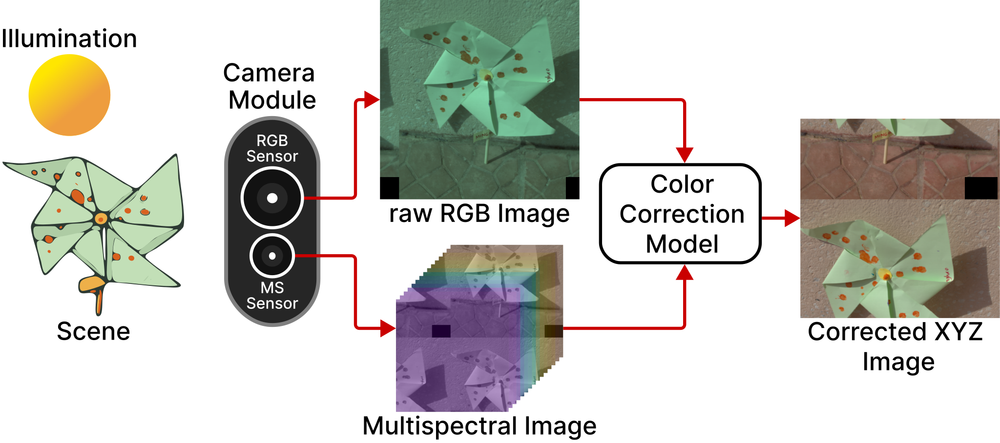

# Leveraging Multispectral Sensors for Color Correction in Mobile Cameras (CVPR, 2026)


<p align="center">
  <a href="https://lucacogo.github.io/">Luca Cogo</a><sup>1</sup>, 
  <a href="http://www.ivl.disco.unimib.it/people/marco-buzzelli/">Marco Buzzelli</a><sup>1</sup>, 
  <a href="http://www.ivl.disco.unimib.it/people/simone-bianco/">Simone Bianco</a><sup>1</sup>,
  <a href="https://jvazquezcorral.github.io/">Javier Vazquez-Corral</a><sup>2,3</sup>,
  <a href="http://www.ivl.disco.unimib.it/people/raimondo-schettini/">Raimondo Schettini</a><sup>1</sup>
  <br>
  <sup>1</sup>University of Milano-Bicocca, 
  <sup>2</sup>Computer Vision Center, 
  <sup>3</sup>Universitat Autònoma de Barcelona, 
  <br><br>
  
  <a href="https://arxiv.org/abs/2512.08441">
    
  </a>
  <a href="https://lucacogo.github.io/Mobile-Spectral-AWB/">
    
  </a>
  <!-- <a href="https://lucacogo.github.io/Mobile-Spectral-AWB/">
    
  </a> -->
</p>

***


## Overview

Recent advances in snapshot multispectral (MS) imaging have enabled compact, low-cost spectral sensors for consumer and mobile devices. By capturing richer spectral information than conventional RGB sensors, these systems can enhance key imaging tasks, including color correction. However, most existing methods treat the color correction pipeline in separate stages, often discarding MS data early in the process. We propose a unified, learning-based framework that (i) performs end-to-end color correction and (ii) jointly leverages data from a high-resolution RGB sensor and an auxiliary low-resolution MS sensor. Our approach integrates the full pipeline within a single model, producing coherent and color-accurate outputs. We demonstrate the flexibility and generality of our framework by refactoring two different state-of-the-art image-to-image architectures. To support training and evaluation, we construct a dedicated dataset by aggregating and repurposing publicly available spectral datasets, rendering under multiple RGB camera sensitivities. Extensive experiments show that our approach improves color accuracy and stability, reducing error by up to 50% compared to RGB-only and MS-driven baselines.

<!-- Add white background to the image -->




## Data

We build a physically grounded synthetic dataset based on two publicly available hyperspectral datasets containing densely sampled spectral reflectance images (see <a href="https://fuqiangx.github.io/publication/li2021multispectral/">KAUST</a> and <a href="https://arxiv.org/abs/2412.14925">BJTU-UVA</a>). From these data, we simulate corresponding RGB and multispectral (MS) measurements across a broad range of illuminants and camera spectral sensitivities, and we render ground-truth color references under the standard D65 illuminant.

To mimic geometric inconsistencies typical of dual-sensor systems, we further create a misaligned version of the dataset by introducing spatial offsets between RGB–MS image pairs. Realistic warping transformations are estimated from the <a href="https://aiff22.github.io/pynet.html">Zurich dataset</a> and applied to our synthesized data.

The dataset will be available soon (once we figure out the best way to share it). 

## Getting Started

Clone the repository and install the required dependencies.

## Train and Inference

Pre-trained models are available in the `pretrained` folder.
Both training and testing can be performed using config files. See some examples in the `conf` folder and refer to the `conf/README.md` for details on how to edit config files.

To run an experiment:
```bash
python run.py path/to/config/file.py
```

